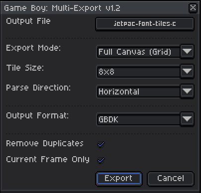
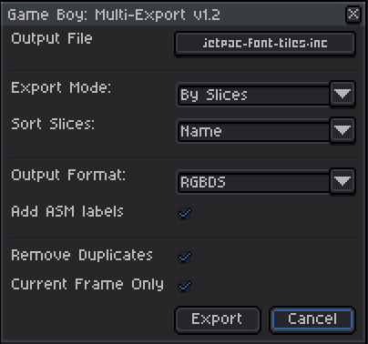

# Game Boy: Multi-Export for Aseprite

This is a small LUA script for exporting your Aseprite graphics into a code
format usable with GBDK (C language) or RGBDS (assembly).





## Output Examples

Example outputs showing two 8x8 tiles of the numbers 0 and 1.

```c
// GBDK example

const unsigned char font_tiles[] = {
  // Name: Char0
  0x00, 0x00, 0x3C, 0x3C, 0x46, 0x46, 0x4A, 0x4A, 0x52, 0x52, 0x62, 0x62, 0x3C, 0x3C, 0x00, 0x00,

  // Name: Char1
  0x00, 0x00, 0x18, 0x18, 0x28, 0x28, 0x08, 0x08, 0x08, 0x08, 0x08, 0x08, 0x3E, 0x3E, 0x00, 0x00,
}

```

```asm
; RGBDS example

Char0::
DW `00000000
DW `00333300
DW `03000330
DW `03003030
DW `03030030
DW `03300030
DW `00333300
DW `00000000


Char1::
DW `00000000
DW `00033000
DW `00303000
DW `00003000
DW `00003000
DW `00003000
DW `00333330
DW `00000000
```

## Installation

Copy the `.lua` script to the Aseprite `scripts` directory and restart Aseprite.


## Usage

**IMPORTANT: use an indexed palette of only 4 colours**

There are several export options for maximum flexibility.

* Export Mode: **Full Canvas (Grid)**
  - Tile Sizes: `8x8`, `8x16`, `16x16`, `32x32`
  - Parse direction (canvas): Vertical or Horizontal
* Export Mode: **By Slices**
  - Sort Slices: Position or Name
  - When using "Name" sprites are sorted alphabetically, otherwise by canvas position
  - When using "Name" ASM labels will use that value, e.g. `RocketU1::`
* Output Format: **GBDK**, **RGBDS**, **RGBDS HEX (DB)**
  - each tile is given a comment with its number, e.g. `Tile 0x3C`
* Add ASM Labels:
  - prefixes each sprite with an ASM label, e.g. `Sprite01::`
  - can only be enabled with RGBDS output
* Remove Duplicates
* Current Frame Only
* A default output filename is used and saved in the same directory as the input file

At the top of the script is a `defaultConfig`. Change this to your preferred
default settings.


## License

Copyright (c) 2026 Michael R. Cook. All rights reserved.

This work is licensed under the terms of the MIT license.
For a copy, see <https://opensource.org/licenses/MIT>.
